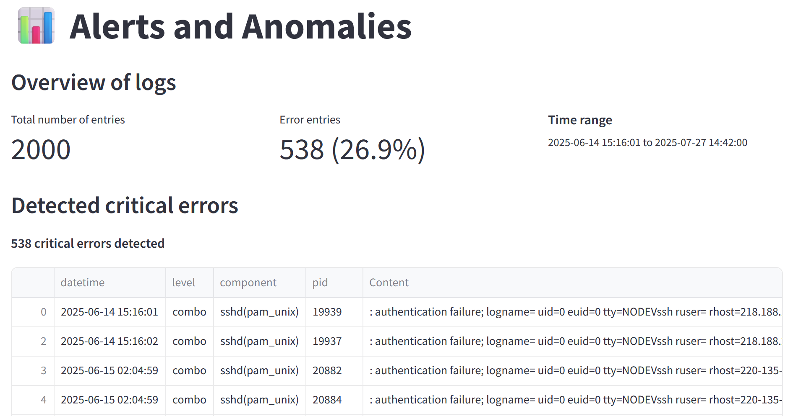
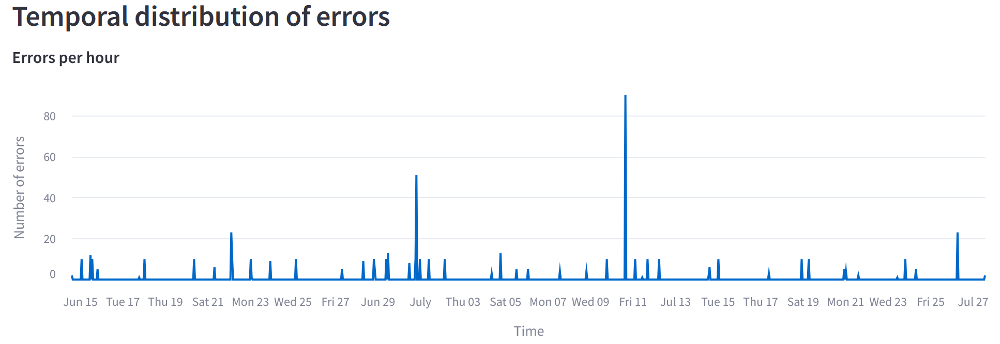
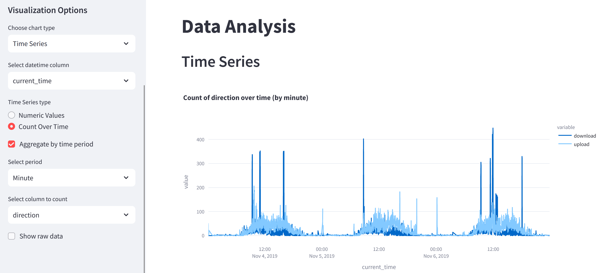

## 🌐 Online Demo

You can try ShadowLog online at our Hugging Face demo: 
[https://huggingface.co/spaces/berangerthomas/shadowlog](https://huggingface.co/spaces/berangerthomas/shadowlog)


## 🔐 ShadowLog - Your Advanced Log Analysis Platform
**Because attacks hide… but your logs don't.**

ShadowLog is a powerful Streamlit-based application designed to simplify and enhance log file analysis. Whether you're debugging an application, monitoring system performance, or investigating security incidents, ShadowLog provides the tools you need to efficiently process and extract insights from your log data.

## 📊 Key Features

- **📁 Log File Upload & Parsing**: Upload and process log files with automatic parsing and filtering
- **📈 Statistical Analysis**: Get comprehensive statistics and insights about your log data
- **🔍 Advanced Data Visualization**: Interactive charts and graphs to spot patterns and anomalies
- **🔎 Powerful Filtering**: Filter logs by time, action type, port ranges, and more
- **🤖 AI-Powered Analytics**: Machine learning clustering to identify patterns and anomalies

## 🚀 Installation

### Prerequisites

- Docker installed on your system

### Quick Start with Docker

1. Clone the repository:
   ```bash
   git clone https://github.com/berangerthomas/ShadowLog.git
   cd ShadowLog
   ```

2. Build the Docker image:
   ```bash
   docker build -t shadowlog .
   ```

3. Run the container:
   ```bash
   docker run -p 8501:8501 shadowlog
   ```

4. Open your browser and navigate to:
   ```
   http://localhost:8501
   ```

### Manual Installation

If you prefer not to use Docker:

1. Clone the repository:
   ```bash
   git clone https://github.com/yourusername/ShadowLog.git
   cd ShadowLog
   ```

2. Install the required packages:
   ```bash
   pip install -r requirements.txt
   ```

3. Run the application:
   ```bash
   streamlit run app.py
   ```

## 📝 Usage Guide

1. **Upload Log Files**: Navigate to the Upload section and upload your log files
2. **Analyze Data**: Use the Statistics section to get an overview of your log data
3. **Visualize Patterns**: Explore visualizations in the Analyze section
4. **Detect Anomalies**: Check the Alerts section for potential security issues
5. **Apply AI Analysis**: Use the Analytics section for advanced pattern detection

ShadowLog currently supports only one log format, describe on the "Upload" page :

| Column name | timestamp | ipsrc | ipdst | protocole | portsrc | portdst | rule | action | interface | unknown | fw |
|------------|-----------|-------|-------|-----------|---------|---------|------|--------|-----------|---------|-----|
| Format | YYYY-MM-DD HH:MM:SS | str | str | str | int | int | int | str | str | str | int |

## 🛠️ Technical Details

ShadowLog is built with:
- **Python 3.11+**
- **Streamlit** for the web interface
- **Polars** and **Pandas** for high-performance data processing
- **Plotly** for interactive visualizations
- **scikit-learn** for machine learning capabilities

## 🖼️ Screenshots





## 🤝 Contributing

Contributions are welcome! To contribute:
1. Fork the repository
2. Create your feature branch (`git checkout -b feature/new-feature`)
3. Commit your changes (`git commit -m 'Add new feature'`)
4. Push to the branch (`git push origin feature/new-feature`)
5. Open a Pull Request

## 📄 License

This project is licensed under the MIT License - see the LICENSE file for details.

## 👥 Authors

- Nancy Randriamiarijaona
- Cyril Kocab
- Béranger Thomas
